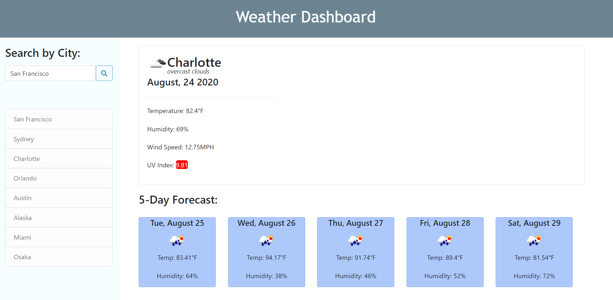

# 06 Server-Side APIs: Weather Dashboard
_[ Link to deployed Application](https://sendymederos.github.io/Weather-App/)_

## Overview

This app is build with HTML, styled with CSS, Bootstrap, and Fontawesome, powered by JavaScript Calling mutiple APIs;
For a traveler,
TO outlook the weather for multiple cities,
SO THAT he can plan a trip accordingly.

## Instructions
GIVEN a weather dashboard with form inputs
WHEN a city is searched
THEN current and future conditions display for that city and that city is added to the search history
IF the search history already contains this city 
It will move that city at the top of the list 
The current weather conditions for that city
Will present the city name, the date, an icon representation of weather conditions,the conditions, the temperature, the humidity, the wind speed, and the UV index
WHEN the UV index displays
THEN a color that indicates the UV index severity displays on the background of this one
The future weather conditions for that city
Display a 5-day forecast with the date, an icon representation of weather conditions, the temperature, and the humidity
WHEN a city in the search history is clicked on
THEN the current and future conditions for that city displays
WHEN the weather dashboard opens
THEN the last searched city forecast displays

## Link To the App

_[ Link to deployed Application](https://sendymederos.github.io/Weather-App/)_

The following image demonstrates the application functionality:

